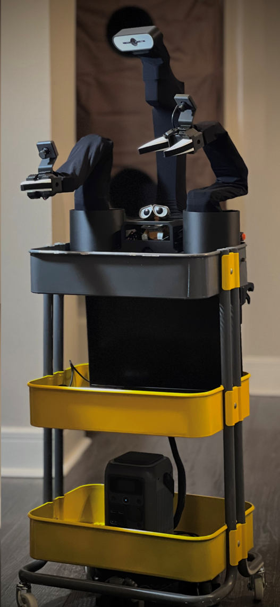
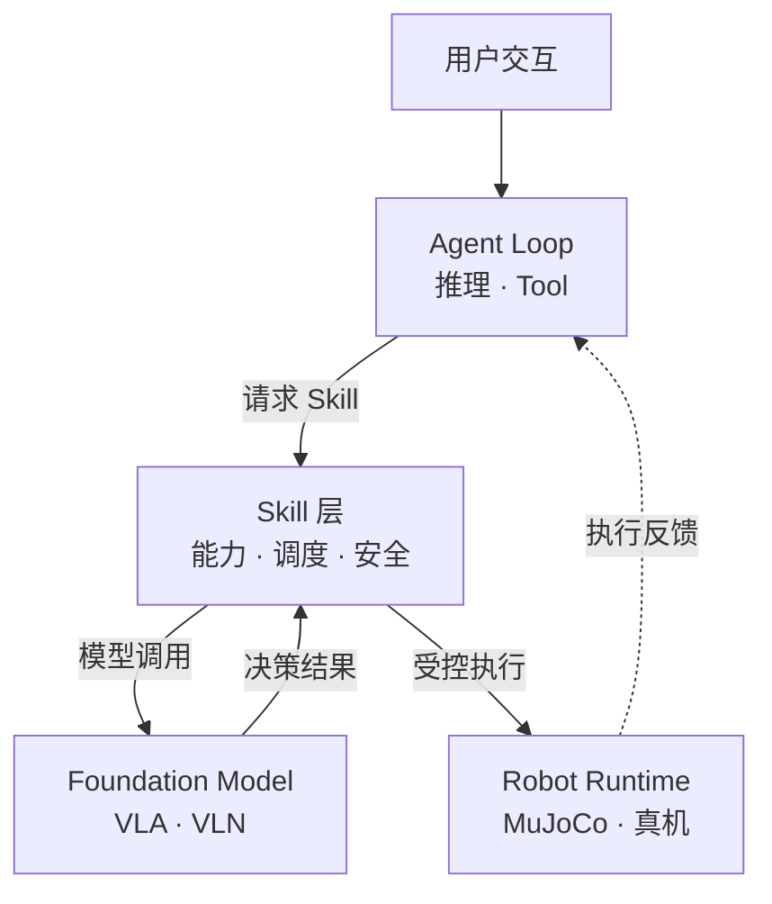

<div align="center">

  <pre>
  ██╗  ██╗██████╗  ██████╗ ████████╗██╗ ██████╗███████╗
  ╚██╗██╔╝██╔══██╗██╔═══██╗╚══██╔══╝██║██╔════╝██╔════╝
   ╚███╔╝ ██████╔╝██║   ██║   ██║   ██║██║     ███████╗
   ██╔██╗ ██╔══██╗██║   ██║   ██║   ██║██║     ╚════██║
  ██╔╝ ██╗██████╔╝╚██████╔╝   ██║   ██║╚██████╗███████║
  ╚═╝  ╚═╝╚═════╝  ╚═════╝    ╚═╝   ╚═╝ ╚═════╝╚══════╝
  </pre>

  # Hey Robot

  <p>
    <em>面向真实机器人的 Embodied Agent Harness · 异步快慢双系统 · 分层解耦的具身智能架构</em>
  </p>

  <p>
    <a href="#features">核心能力</a> ·
    <a href="#architecture">系统架构</a> ·
    <a href="#quick-start">快速开始</a> ·
    <a href="#real-robot">真机部署</a> ·
    <a href="#documentation">项目文档</a> ·
    <a href="docs/README_EN.md">English</a>
  </p>

  <p>
    <a href="LICENSE"></a>
    <a href="https://github.com/Xbotics-Embodied-AI-club/Xbotics-Hey-Robot"></a>
    
    
  </p>

</div>

---

Hey Robot 是一个不依赖通用 LLM Agent 框架、面向真实机器人构建的
**Embodied Agent Harness**。

系统采用异步快慢双系统和分层解耦架构。Agent Loop 驱动模型推理与 Tool 使用；
机器人能力不直接作为 Tool 暴露，而是通过统一入口请求 Skill，并根据执行反馈持续推进任务。
Skill 能力将以 VLA、VLN 等具身模型为主要方向，通过 Robot Runtime 作用于仿真或真机。

当前以 [XLeRobot](https://github.com/Vector-Wangel/XLeRobot) 为主要载体，支持
MuJoCo 仿真和真实硬件部署。

<p align="center">
  
</p>

> **项目状态**：当前处于 active development。VLA/VLN 属于实验能力，
> 任何机器人运动都应先在仿真中验证。

<span id="features"></span>

## 核心能力

- **Agent Loop 驱动**：Agent 根据当前任务进行推理，按需调用 Tool，并结合返回结果继续规划和执行。
- **Tool 与 Skill 分离**：Tool 用于状态、感知和记忆等交互；机器人能力通过统一入口请求 Skill。
- **感知与执行反馈**：结合相机观察、机器人状态和执行结果持续调整任务。
- **仿真与真机部署**：支持 MuJoCo 仿真和 XLeRobot 真实硬件。
- **多种交互方式**：支持 Web、CLI、语音和飞书。
- **任务追踪与恢复**：提供任务状态、执行记录、失败恢复和 Tasks UI。
- **具身模型驱动**：Skill 能力以 VLA、VLN 等具身模型为主要发展方向。

<span id="architecture"></span>

## 系统架构

快慢双系统描述不同的决策层级：

- **慢系统**：负责语言理解、任务规划、记忆和失败恢复。
- **快系统**：负责感知、局部决策、安全检查和机器人执行。

各层通过清晰的能力边界协作：



这种分层让 Agent、机器人能力、具身模型和具体硬件可以分别演进，同时保持完整的
任务执行与反馈闭环。

详细设计见 [系统架构](docs/architecture/system-architecture.md)。

<span id="quick-start"></span>

## 快速开始

### 环境要求

- Ubuntu / Linux
- Python `3.12`
- [uv](https://docs.astral.sh/uv/)
- NATS server，或 Docker
- MuJoCo
- 可用的大模型 API

> 当前推荐 Ubuntu。仓库保留了 Windows 配置，但现有依赖锁仅支持 Linux。

### 安装依赖

```bash
git clone https://github.com/Xbotics-Embodied-AI-club/Xbotics-Hey-Robot.git
cd Xbotics-Hey-Robot

uv sync --group dev --group sim
cp .env.example .env
```

根据所选模型服务填写 `.env`。默认仿真配置使用：

```text
DEEPSEEK_MODEL
DEEPSEEK_API_KEY
DEEPSEEK_BASE_URL
DASHSCOPE_MODEL
DASHSCOPE_API_KEY
```

> 更完整的环境、模型、语音、飞书、仿真与真机配置，请阅读
> [在线配置指南（持续更新）](https://my.feishu.cn/docx/LT3odU5yyoMOCNxXmmicvbCznBb)。

### 启动 NATS

```bash
nats-server
```

也可以使用 Docker：

```bash
docker compose up -d nats
```

### 运行 MuJoCo 仿真

默认仿真配置同时启用了语音和飞书。首次只使用 Web 时，请先关闭对应通道；
具体配置见 [XLeRobot 仿真部署](docs/operations/xlerobot-sim.md)。

```bash
uv run hey-robot inspect --config configs/xlerobot.sim.ubuntu.yaml
uv run hey-robot run --config configs/xlerobot.sim.ubuntu.yaml
```

启动后访问：

| 页面 | 地址 |
|---|---|
| 对话界面 | <http://127.0.0.1:8080/chat> |
| 任务看板 | <http://127.0.0.1:8080/tasks> |

<span id="real-robot"></span>

## XLeRobot 真机

真机运行前先检查平台、部署配置和硬件映射：

```bash
uv run python scripts/ops/check_platform.py \
  --config configs/xlerobot.real.ubuntu.yaml

uv run hey-robot inspect \
  --config configs/xlerobot.real.ubuntu.yaml

uv run python scripts/robots/xlerobot/diagnose.py \
  --config configs/xlerobot.real.ubuntu.yaml
```

确认串口、舵机、相机和电池状态后启动：

```bash
uv run hey-robot run --config configs/xlerobot.real.ubuntu.yaml
```

详细步骤见 [XLeRobot 真机部署](docs/operations/xlerobot-real.md)。

## VLA / VLN

VLA 和 VLN 以独立模型服务接入，用于机器人操作和视觉语言导航。
相关代码和实验配置已经纳入仓库，但模型权重、GPU 环境和完整执行闭环仍需单独准备与验证。

实验入口见 `configs/xlerobot.sim.vla_vln.yaml`，技术细节见
[ModelService RPC 协议](docs/architecture/model-service-rpc-proto.md)。

## 安全提示

- 先在 MuJoCo 仿真中验证，再接入真实机器人。
- 真机运行时保持急停或断电手段可用。
- 不要在人员、宠物、易碎物或不稳定环境附近直接测试运动能力。
- 修改串口、舵机 ID、相机编号或机械结构后，重新运行诊断。
- VLA/VLN 必须单独验证后才能用于真机运动。

## 参与开发

```bash
uv run poe style
uv run poe lint
uv run poe test
```

主要目录：

```text
src/        核心系统代码
configs/    仿真与真机配置
frontend/   Web 交互界面
docs/       架构、部署和开发文档
scripts/    诊断、模型下载和维护脚本
tests/      单元与集成测试
```

贡献前请阅读 [贡献指南](docs/development/contributing.md) 和
[Skill 扩展指南](docs/development/skill-extension.md)。

<span id="documentation"></span>

## 项目文档

| 主题 | 文档 |
|---|---|
| 完整配置 | [在线配置指南（持续更新）](https://my.feishu.cn/docx/LT3odU5yyoMOCNxXmmicvbCznBb) |
| 系统概览 | [部署与运行形态](docs/overview/runtime-shape.md) |
| 架构设计 | [系统架构](docs/architecture/system-architecture.md) |
| Agent 与机器人能力 | [Agent 与 Skill 边界](docs/architecture/agent-skill-boundaries.md) |
| MuJoCo 仿真 | [XLeRobot 仿真部署](docs/operations/xlerobot-sim.md) |
| 真实机器人 | [XLeRobot 真机部署](docs/operations/xlerobot-real.md) |
| 开发扩展 | [Skill 扩展指南](docs/development/skill-extension.md) |

## 活动与参考

本项目来自开源机器人 XLeRobot 动手实战工作坊相关实践。

- [开源机器人 XLeRobot 动手实战工作坊](https://mp.weixin.qq.com/s/TahLTjvvP9MoisCOCVkEBA)
- [XLeRobot 官方仓库](https://github.com/Vector-Wangel/XLeRobot)
- [项目活动与参考资料](docs/references/project-references.md)

## 社区

<div align="center">
  <table>
    <tr>
      <td align="center">
        
        <br />
        <sub>Xbotics 公众号</sub>
      </td>
      <td align="center">
        
        <br />
        <sub>开发者微信</sub>
      </td>
    </tr>
  </table>
</div>

## License

MIT License. See [LICENSE](LICENSE).
