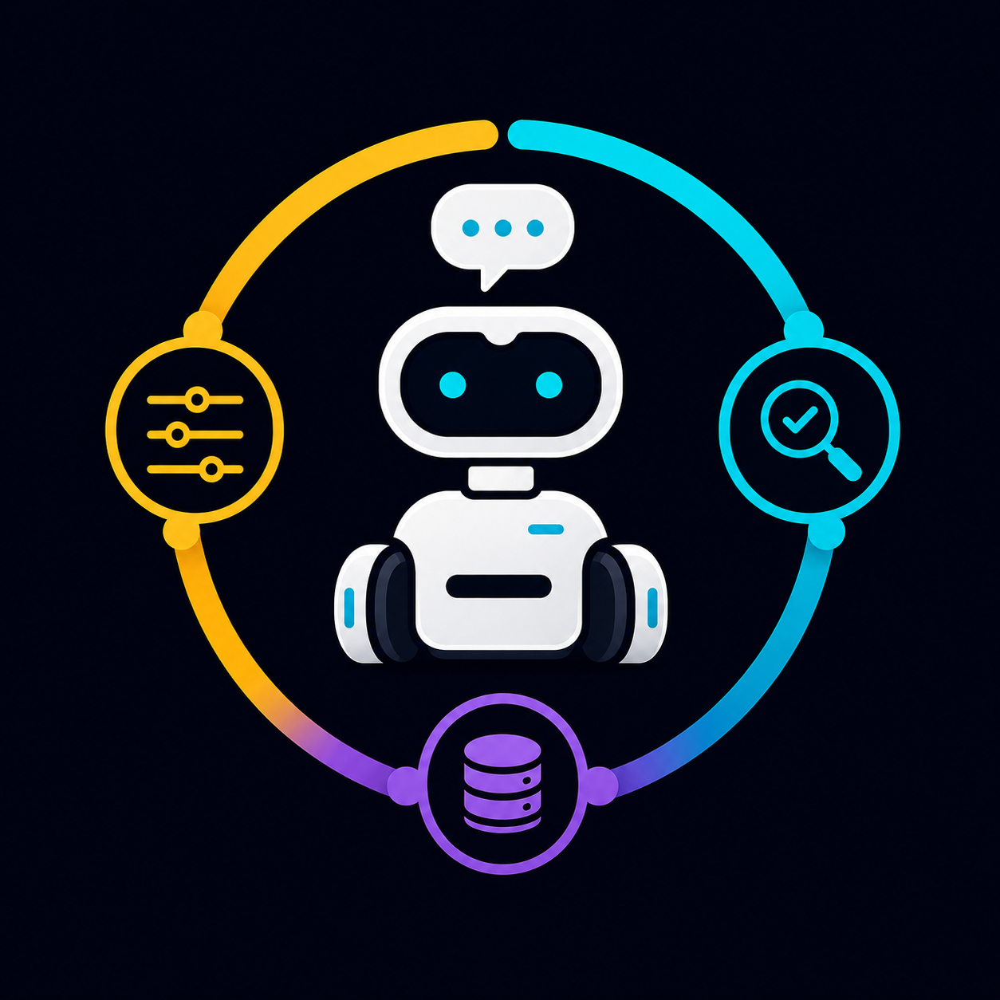
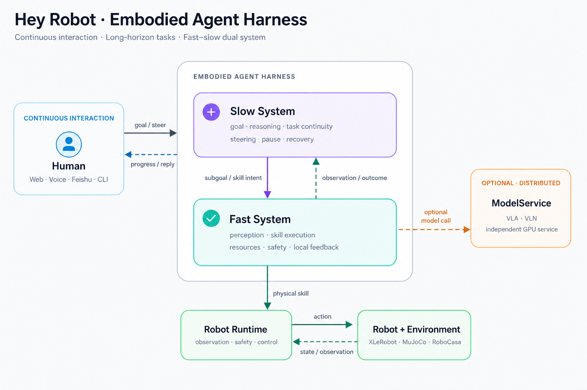

<div align="center">

<pre>
  ██╗  ██╗██████╗  ██████╗ ████████╗██╗ ██████╗███████╗
  ╚██╗██╔╝██╔══██╗██╔═══██╗╚══██╔══╝██║██╔════╝██╔════╝
   ╚███╔╝ ██████╔╝██║   ██║   ██║   ██║██║     ███████╗
   ██╔██╗ ██╔══██╗██║   ██║   ██║   ██║██║     ╚════██║
  ██╔╝ ██╗██████╔╝╚██████╔╝   ██║   ██║╚██████╗███████║
  ╚═╝  ╚═╝╚═════╝  ╚═════╝    ╚═╝   ╚═╝╚═════╝╚══════╝
</pre>



<h1>Hey Robot</h1>

<p><em>Embodied Agent Harness · Fast–Slow Dual System · Distributed Model Services</em></p>

<p>
  <a href="https://github.com/Xbotics-Embodied-AI-club/Xbotics-Hey-Robot">GitHub</a> ·
  <a href="#quick-start">Quick Start</a> ·
  <a href="#architecture">Architecture</a> ·
  <a href="#community">Community</a> ·
  <a href="docs/README_ZH.md">简体中文</a>
</p>

<p>
  <a href="LICENSE"></a>
  
  
  
  
</p>

</div>

<br />

An open-source Embodied Agent Harness for interactive long-horizon robot tasks.

Hey Robot separates a robot Agent into two systems with explicit boundaries:

```text
user / environment event
        ↓
slow system: Agent, task continuity, user steering, Skill selection
        ↓ typed proposal
fast system: Skill, observation, Robot Runtime, safety, driver
        ↓ structured outcome + fresh observation
slow system continues reasoning
```

The goal is not to make one model emit an increasingly long action sequence. The goal is to let a
robot remain interactive, advance a task across multiple Skills, respond to failures and corrections,
and safely recover task facts after a process restart.

<h2 id="status">Current Status</h2>

Hey Robot has moved from the basic Harness skeleton into model and environment integration:

- the Agent, Skill, Task, Robot Runtime, and ModelService path is in place;
- XLeRobot MuJoCo provides the simulation loop;
- InternNav is integrated with XLeRobot MuJoCo through an independent VLN ModelService;
- LeRobot policy is integrated with RoboCasa365 through the shared ModelService contract, completing
  the full-system validation path;
- the XLeRobot native driver, mobile base, arm, cameras, and Robot Runtime provide the real-hardware base;
- the next stage is XLeRobot hardware validation of InternNav and LeRobot policy execution, calibration,
  and safety.

The next milestone is transferring the integrated navigation and manipulation policies to XLeRobot
hardware and validating the real observation, action, and safety loop.

<p align="center">
  
</p>

<p align="center"><sub>Distributed model services, the fast–slow system, and one physical execution path.</sub></p>

<h2 id="why">Why a Harness?</h2>

A conventional LLM tool loop can choose the next call, but a robot must also handle:

- observations that become stale as actions change the world;
- shared mobile-base, arm, camera, and safety resources;
- user corrections arriving during physical execution;
- Skills that can time out, fail, be cancelled, or lose execution ownership;
- process restarts before a task completes;
- the fact that a returned call is not the same as physical task completion.

Hey Robot handles these concerns in the Harness rather than delegating all of them to a prompt. The model
proposes one schema-constrained action; the Skill and Robot Runtime own bounded execution, resource
exclusion, cancellation, safety checks, results, and observations.

<h2>Core Design</h2>

### One Agent, one task truth, one physical execution path

The current system maintains these invariants:

1. one deployment enables one autonomous Agent;
2. one session has at most one non-terminal task;
3. one Agent decision proposes at most one physical action;
4. a Skill submission is persisted before it is dispatched;
5. terminal Skill events update task steps idempotently and wake the Agent;
6. an unknown physical result is never replayed automatically;
7. emergency stop bypasses model reasoning and follows a deterministic control path.

### Configuration drives composition, not runtime state

Deployment configuration selects Channels, Robots, ModelServices, Skill surfaces, the bus, and resource
paths. It does not store task progress or robot state and does not act as a hidden workflow language.
ConversationStore, AgentTaskStore, RunStore, and Robot Runtime own their respective runtime facts.

### Replaceable model and robot boundaries

The same Skill surface can wrap classic control, InternNav, LeRobot policy, or another independent model
service. Model services do not own task lifecycle, the Agent does not access drivers directly, and Robot
Runtime does not depend on the upper Agent layer. Typed ModelService/gRPC contracts split the Agent system
from model services across processes, dependency environments, and GPUs.

<h2 id="architecture">Distributed Embodied Agent Harness · Fast–Slow Dual System</h2>

The Agent system is separated from model services such as InternNav, VLA/VLN, and LeRobot policy. Models
can run in independent processes, dependency environments, and GPU allocations. “Fast” and “slow” describe
decision horizons rather than hard real-time guarantees. The slow system maintains goals, interaction, and
task continuity; the fast system turns one bounded capability into guarded model, simulation, or hardware
execution.

<table>
  <thead><tr><th></th><th>Slow · Deliberative</th><th>Fast · Embodied Execution</th></tr></thead>
  <tbody>
    <tr><td>Horizon</td><td>Across turns, Skills, and service restarts</td><td>One bounded Skill and its local control process</td></tr>
    <tr><td>Responsibilities</td><td>Goal interpretation, Tool selection, task progress, pause, and recovery</td><td>Perception, resource admission, model inference, safety checks, and robot execution</td></tr>
    <tr><td>Implementation</td><td><code>Agent</code>, <code>AgentRunner</code>, <code>AgentTaskStore</code>, <code>TaskCoordinator</code></td><td><code>SkillWorker</code>, VLA/VLN options, <code>RobotRuntime</code>, Robot Drivers</td></tr>
  </tbody>
</table>

<h2 id="capability-status">Implemented and In-Progress Capabilities</h2>

<table>
  <thead><tr><th>Capability</th><th>Status</th><th>Boundary</th></tr></thead>
  <tbody>
    <tr><td>Agent Tool loop</td><td>Implemented</td><td>At most one proposal per decision; malformed calls are rejected structurally</td></tr>
    <tr><td>Durable tasks</td><td>Implemented</td><td>SQLite task/step state, continuation, pause, cancellation, and startup recovery</td></tr>
    <tr><td>Skill Harness</td><td>Implemented</td><td>Schema, resources, timeout, cancellation, events, and RunStore</td></tr>
    <tr><td>XLeRobot MuJoCo</td><td>Integrated</td><td>Simulation driver, observation, and robot-capability loop</td></tr>
    <tr><td>InternNav XLeRobot simulation</td><td>Integrated and path-validated</td><td>Independent VLN ModelService, observe-plan-act, and motion mapping; hardware pending</td></tr>
    <tr><td>LeRobot policy ModelService</td><td>Integrated</td><td>Independent policy process, observation/action mapping, and shared gRPC contract</td></tr>
    <tr><td>RoboCasa365</td><td>Full-system path validated</td><td>LeRobot policy, ModelService, Robot Runtime, and environment are connected end to end</td></tr>
    <tr><td>XLeRobot native driver</td><td>Integrated</td><td>Per-machine calibration, diagnostics, action bounds, and physical safety remain required</td></tr>
    <tr><td>XLeRobot hardware InternNav / LeRobot</td><td>Next stage</td><td>Real observations, action spaces, cancellation, timeout, and safety loop</td></tr>
  </tbody>
</table>

<h2 id="quick-start">Quick Start</h2>

Recommended: Ubuntu/Linux, Python 3.12, and <a href="https://docs.astral.sh/uv/">uv</a>. A bare
<code>uv sync</code> does not install the complete Gateway, Agent, Robot, and MuJoCo dependency set;
use the profile command below.

```bash
git clone https://github.com/Xbotics-Embodied-AI-club/Xbotics-Hey-Robot.git
cd Xbotics-Hey-Robot

uv sync --extra gateway --extra agent --extra robot --group sim --group dev
cp .env.example .env

uv run hey-robot inspect --config configs/xlerobot.sim.ubuntu.yaml
uv run hey-robot run --config configs/xlerobot.sim.ubuntu.yaml
```

InternNav simulation requires an independent model environment and the InternNav submodule. See
[`docs/operations/xlerobot-sim.md`](docs/operations/xlerobot-sim.md).

For the full RoboCasa365 evaluation path, see
[`docs/evaluation/robocasa365/runbook.zh-CN.md`](docs/evaluation/robocasa365/runbook.zh-CN.md).

<h2 id="real-robot">XLeRobot Hardware</h2>

The default hardware profile exposes only scene inspection and basic base motion. Before connecting
hardware, validate the platform, serial bus, servos, cameras, battery, and physical emergency stop:

```bash
uv run python scripts/ops/check_platform.py \
  --config configs/xlerobot.real.ubuntu.yaml
uv run hey-robot inspect --config configs/xlerobot.real.ubuntu.yaml
uv run python scripts/robots/xlerobot/diagnose.py \
  --config configs/xlerobot.real.ubuntu.yaml
```

InternNav and LeRobot policy already have shared integration paths, but simulation or RoboCasa365 profiles
must not be used directly on hardware. A hardware profile must independently validate:

- camera and observation mapping;
- action dimensions, ranges, and frequency;
- calibration, home/rest positions, and resource exclusion;
- timeout, cancellation, and emergency stop;
- unloaded, low-speed execution in a controlled workspace.

See [`docs/operations/xlerobot-real.md`](docs/operations/xlerobot-real.md) for the complete procedure.

<h2 id="safety">Safety Boundaries</h2>

- validate all motion in MuJoCo before connecting real hardware;
- keep a physical emergency stop or power cutoff available during hardware tests;
- validate model observations, actions, and safety settings for the target robot;
- explicitly expose arm, base, and VLA/VLN permissions through `skills.tools`.

<h2 id="code-structure">Code Structure</h2>

<table>
  <thead><tr><th>Path</th><th>Responsibility</th></tr></thead>
  <tbody>
    <tr><td><code>src/hey_robot/cognition</code></td><td>Agent, task state, conversation context, and Tool loop</td></tr>
    <tr><td><code>src/hey_robot/skills</code></td><td>Skill schema, worker, option runners, and result contracts</td></tr>
    <tr><td><code>src/hey_robot/robot_runtime</code></td><td>Resources, safety, observations, and robot execution boundary</td></tr>
    <tr><td><code>src/hey_robot/robot_backends</code></td><td>MuJoCo, XLeRobot, and RoboCasa environment adapters</td></tr>
    <tr><td><code>src/hey_robot/foundation</code></td><td>VLA/VLN/LeRobot ModelService contracts and backends</td></tr>
    <tr><td><code>src/hey_robot/config</code></td><td>Typed deployment configuration and startup validation</td></tr>
    <tr><td><code>configs/</code></td><td>Deployment, simulation, hardware, and evaluation profiles</td></tr>
    <tr><td><code>tests/</code></td><td>Contract, architecture-boundary, component, and integration tests</td></tr>
  </tbody>
</table>

<h2 id="documentation">Documentation</h2>

- [Documentation index](docs/index.md)
- [System architecture](docs/architecture/system-architecture.md)
- [Configuration reference](docs/reference/configuration.md)
- [XLeRobot simulation](docs/operations/xlerobot-sim.md)
- [XLeRobot hardware](docs/operations/xlerobot-real.md)
- [RoboCasa365 evaluation](docs/evaluation/robocasa365/runbook.zh-CN.md)
- [Minimal Embodied Agent Harness guide](docs/development/minimal-embodied-agent-harness-guide.zh-CN.md)
- [Paper draft](docs/references/paper-draft.md)

<h2 id="development">Development Checks</h2>

```bash
uv run poe style
uv run poe lint
uv run poe test
```

<h2 id="community">Community and Contributions</h2>

Hey Robot grows from the open-source XLeRobot ecosystem. Contributions to the Harness, robot drivers,
interaction surfaces, and embodied-model integrations are welcome through Issues, Pull Requests, and the
community channels below.

<div align="center">
  <table>
    <tr>
      <td align="center">
        
        <br /><sub>Xbotics official account</sub>
      </td>
      <td align="center">
        
        <br /><sub>Developer contact</sub>
      </td>
    </tr>
  </table>
</div>

Before contributing, read [`CONTRIBUTING.md`](CONTRIBUTING.md) and
[`docs/development/skill-extension.md`](docs/development/skill-extension.md).

<p align="center">
  <a href="https://github.com/Vector-Wangel/XLeRobot">XLeRobot</a> ·
  <a href="docs/references/project-references.md">Project references</a> ·
  <a href="LICENSE">MIT License</a>
</p>

<h2 id="license">License</h2>

This project is licensed under the [MIT License](LICENSE). Papers, third-party models, and reference
materials remain subject to their own licenses and upstream terms.
