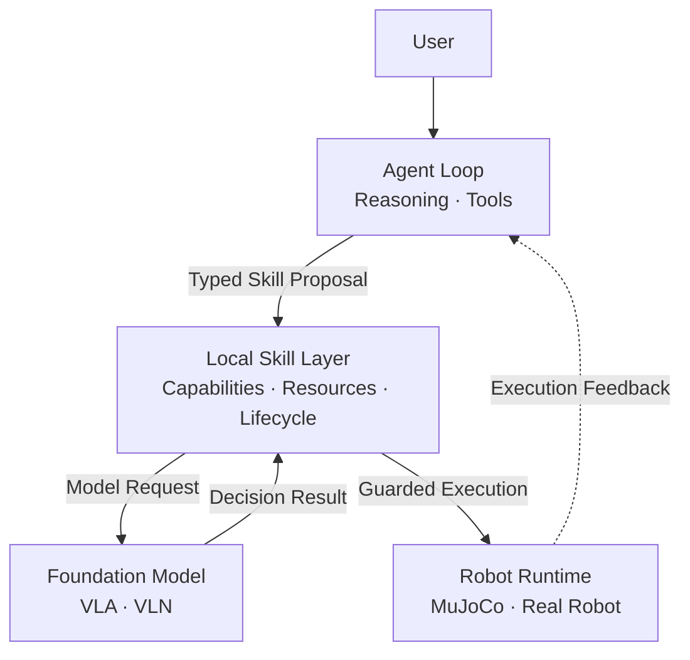

# Hey Robot

<div align="center">
  <sub><a href="../README.md">简体中文</a> | English</sub>
</div>

Hey Robot is an **Embodied Agent Harness** built for real robots without relying
on a general-purpose LLM agent framework.

It combines an asynchronous fast/slow system with a layered architecture.
The Agent Loop drives model reasoning and tool use. Skills selected by the
deployment are projected as individual model tools, while typed proposals enter
execution through one `SkillClient` boundary.
Skills are intended to be driven primarily by embodied models such as VLA and VLN,
then applied to simulation or real hardware through the Robot Runtime.

[XLeRobot](https://github.com/Vector-Wangel/XLeRobot) is the current primary
embodiment, with MuJoCo simulation and real-hardware deployment.

> **Status:** active development. VLA/VLN capabilities are experimental.
> Validate all robot motion in simulation before using real hardware.

## Features

- Agent Loop reasoning that invokes tools as needed and replans from their results.
- Skill schemas projected as model tools and executed through one typed SkillClient boundary.
- Perception and execution feedback from cameras and robot state.
- MuJoCo simulation and XLeRobot real-hardware deployment.
- Web, CLI, voice, and Feishu interaction channels.
- Task tracking, execution history, recovery, and a Tasks UI.
- Embodied-model-driven skills, with VLA/VLN as the primary direction.

## Architecture

The fast/slow system describes two decision levels:

- **Slow system:** language understanding, task planning, memory, and recovery.
- **Fast system:** perception, local decisions, safety checks, and execution.



See [System Architecture](architecture/system-architecture.md) for details.
The Agent, Skill Worker, and Robot Runtime currently run in one main process;
VLA/VLN ModelServices can be deployed independently over gRPC.

## Quick Start

### Requirements

- Ubuntu / Linux
- Python 3.12
- [uv](https://docs.astral.sh/uv/)
- NATS server or Docker only when using `deployment.bus.type: nats`
- An available LLM API

> Ubuntu is the recommended platform. The main harness, native robot, and MuJoCo
> paths have Windows profiles; VLA/VLN, RoboCasa365, and CUDA model environments
> primarily target Linux x86_64 and require separate validation.

### Install

```bash
git clone https://github.com/Xbotics-Embodied-AI-club/Xbotics-Hey-Robot.git
cd Xbotics-Hey-Robot

uv sync --group dev --group sim
cp .env.example .env
```

The default simulation profile uses:

```text
DEEPSEEK_MODEL
DEEPSEEK_API_KEY
DEEPSEEK_BASE_URL
DASHSCOPE_MODEL
DASHSCOPE_API_KEY
DASHSCOPE_BASE_URL
```

See the repository-owned [Configuration Reference](reference/configuration.md)
for core fields and environment variables, and the [Documentation Index](index.md)
for channel, simulation, and real-hardware guides.

### Run MuJoCo Simulation

The default Ubuntu simulation profile uses an in-process bus and enables only
the Web channel. It does not require NATS, voice, or Feishu credentials:

```bash
uv run hey-robot inspect --config configs/xlerobot.sim.ubuntu.yaml
uv run hey-robot run --config configs/xlerobot.sim.ubuntu.yaml
```

Open:

- Chat: <http://127.0.0.1:8080/chat>
- Tasks: <http://127.0.0.1:8080/tasks>

Real-hardware, Windows simulation, and VLA/VLN experiment profiles may use
NATS. Read the [simulation guide](operations/xlerobot-sim.md) before using those
profiles, then run `nats-server` or `docker compose up -d nats` when required.

## XLeRobot Real Hardware

Check the platform, deployment, and hardware mapping first:

```bash
uv run python scripts/ops/check_platform.py \
  --config configs/xlerobot.real.ubuntu.yaml

uv run hey-robot inspect \
  --config configs/xlerobot.real.ubuntu.yaml

uv run python scripts/robots/xlerobot/diagnose.py \
  --config configs/xlerobot.real.ubuntu.yaml
```

After verifying serial ports, servos, cameras, and battery state:

```bash
uv run hey-robot run --config configs/xlerobot.real.ubuntu.yaml
```

See [XLeRobot Real Deployment](operations/xlerobot-real.md) for the complete
procedure.

## VLA / VLN

VLA and VLN are integrated as independent model services for manipulation and
vision-language navigation. Their code and experimental profile are included,
but model weights, GPU setup, and the complete execution loop require separate
deployment validation.

See `configs/xlerobot.sim.vla_vln.yaml` and the
[ModelService RPC documentation](architecture/model-service-rpc-proto.md).

## Safety

- Validate motion in MuJoCo before using real hardware.
- Keep an emergency stop or power cutoff available.
- Do not test motion near people, pets, fragile objects, or unsafe environments.
- Re-run diagnostics after changing serial ports, servo IDs, cameras, or mechanics.
- Validate VLA/VLN separately before allowing real-robot motion.

## Development

```bash
uv run poe style
uv run poe lint
uv run poe test
```

Main directories:

```text
src/        core system
configs/    simulation and real-hardware profiles
frontend/   Web interface
docs/       architecture, operations, and development guides
scripts/    diagnostics, model downloads, and maintenance
tests/      unit and integration tests
```

Read the [Contribution Guide](../CONTRIBUTING.md) and
[Skill Extension Guide](development/skill-extension.md) before contributing.

## Documentation

| Topic | Document |
|---|---|
| Documentation entry point | [Index and sources of truth](index.md) |
| Configuration | [Configuration Reference](reference/configuration.md) |
| Architecture | [System Architecture](architecture/system-architecture.md) |
| MuJoCo simulation | [XLeRobot Simulation](operations/xlerobot-sim.md) |
| Real hardware | [XLeRobot Real Deployment](operations/xlerobot-real.md) |
| RoboCasa365 evaluation | [Evaluation Runbook (Chinese)](evaluation/robocasa365/runbook.zh-CN.md) |
| Extensions | [Skill Extension Guide](development/skill-extension.md) |
| Documentation audit | [2026-07-25 audit (Chinese)](maintenance/documentation-audit-2026-07-25.zh-CN.md) |

## License

MIT License. See [LICENSE](../LICENSE).
