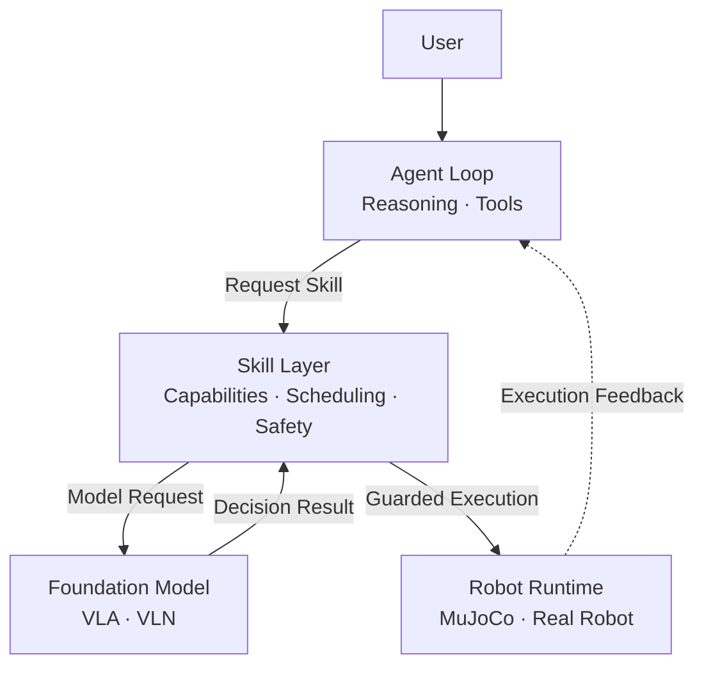

# Hey Robot

<div align="center">
  <sub><a href="../README.md">简体中文</a> | English</sub>
</div>

Hey Robot is an **Embodied Agent Harness** built for real robots without relying
on a general-purpose LLM agent framework.

It combines an asynchronous fast/slow system with a layered architecture.
The Agent Loop drives model reasoning and tool use. Robot capabilities are not
exposed as individual tools; they enter the Skill layer through one unified request.
Skills are intended to be driven primarily by embodied models such as VLA and VLN,
then applied to simulation or real hardware through the Robot Runtime.

[XLeRobot](https://github.com/Vector-Wangel/XLeRobot) is the current primary
embodiment, with MuJoCo simulation and real-hardware deployment.

> **Status:** active development. VLA/VLN capabilities are experimental.
> Validate all robot motion in simulation before using real hardware.

## Features

- Agent Loop reasoning that invokes tools as needed and replans from their results.
- Separate Tool and Skill surfaces connected through one robot-skill request gateway.
- Perception and execution feedback from cameras and robot state.
- MuJoCo simulation and XLeRobot real-hardware deployment.
- Web, CLI, voice, and Feishu interaction channels.
- Task tracking, execution history, recovery, and a Tasks UI.
- Embodied-model-driven skills, with VLA/VLN as the primary direction.

## Architecture

The fast/slow system describes two decision levels:

- **Slow system:** language understanding, task planning, memory, and recovery.
- **Fast system:** perception, local decisions, safety checks, and execution.



See [System Architecture](architecture/system-architecture.md) for details.

## Quick Start

### Requirements

- Ubuntu / Linux
- Python 3.12
- [uv](https://docs.astral.sh/uv/)
- NATS server, or Docker
- MuJoCo
- An available LLM API

> Ubuntu is the recommended platform. Windows profiles remain in the repository,
> but the current dependency lock supports Linux only.

### Install

```bash
git clone https://github.com/Xbotics-Embodied-AI-club/Xbotics-Hey-Robot.git
cd Xbotics-Hey-Robot

uv sync --group dev --group sim
cp .env.example .env
```

The default simulation profile uses:

```text
DEEPSEEK_MODEL
DEEPSEEK_API_KEY
DEEPSEEK_BASE_URL
DASHSCOPE_MODEL
DASHSCOPE_API_KEY
```

> For complete environment, model, channel, simulation, and real-hardware
> configuration, see the
> [live configuration guide (Chinese)](https://my.feishu.cn/docx/LT3odU5yyoMOCNxXmmicvbCznBb).

### Start NATS

```bash
nats-server
```

Or use Docker:

```bash
docker compose up -d nats
```

### Run MuJoCo Simulation

The default profile also enables voice and Feishu. Disable those channels before
a Web-only first run, or configure them as described in the
[simulation guide](operations/xlerobot-sim.md).

```bash
uv run hey-robot inspect --config configs/xlerobot.sim.ubuntu.yaml
uv run hey-robot run --config configs/xlerobot.sim.ubuntu.yaml
```

Open:

- Chat: <http://127.0.0.1:8080/chat>
- Tasks: <http://127.0.0.1:8080/tasks>

## XLeRobot Real Hardware

Check the platform, deployment, and hardware mapping first:

```bash
uv run python scripts/ops/check_platform.py \
  --config configs/xlerobot.real.ubuntu.yaml

uv run hey-robot inspect \
  --config configs/xlerobot.real.ubuntu.yaml

uv run python scripts/robots/xlerobot/diagnose.py \
  --config configs/xlerobot.real.ubuntu.yaml
```

After verifying serial ports, servos, cameras, and battery state:

```bash
uv run hey-robot run --config configs/xlerobot.real.ubuntu.yaml
```

See [XLeRobot Real Deployment](operations/xlerobot-real.md) for the complete
procedure.

## VLA / VLN

VLA and VLN are integrated as independent model services for manipulation and
vision-language navigation. Their code and experimental profile are included,
but model weights, GPU setup, and the complete execution loop require separate
deployment validation.

See `configs/xlerobot.sim.vla_vln.yaml` and the
[ModelService RPC documentation](architecture/model-service-rpc-proto.md).

## Safety

- Validate motion in MuJoCo before using real hardware.
- Keep an emergency stop or power cutoff available.
- Do not test motion near people, pets, fragile objects, or unsafe environments.
- Re-run diagnostics after changing serial ports, servo IDs, cameras, or mechanics.
- Validate VLA/VLN separately before allowing real-robot motion.

## Development

```bash
uv run poe style
uv run poe lint
uv run poe test
```

Main directories:

```text
src/        core system
configs/    simulation and real-hardware profiles
frontend/   Web interface
docs/       architecture, operations, and development guides
scripts/    diagnostics, model downloads, and maintenance
tests/      unit and integration tests
```

Read the [Contribution Guide](development/contributing.md) and
[Skill Extension Guide](development/skill-extension.md) before contributing.

## Documentation

| Topic | Document |
|---|---|
| Complete configuration | [Live configuration guide (Chinese)](https://my.feishu.cn/docx/LT3odU5yyoMOCNxXmmicvbCznBb) |
| Runtime overview | [Deployment and Runtime Shape](overview/runtime-shape.md) |
| Architecture | [System Architecture](architecture/system-architecture.md) |
| Agent and capabilities | [Agent and Skill Boundaries](architecture/agent-skill-boundaries.md) |
| MuJoCo simulation | [XLeRobot Simulation](operations/xlerobot-sim.md) |
| Real hardware | [XLeRobot Real Deployment](operations/xlerobot-real.md) |
| Extensions | [Skill Extension Guide](development/skill-extension.md) |

## License

MIT License. See [LICENSE](../LICENSE).
