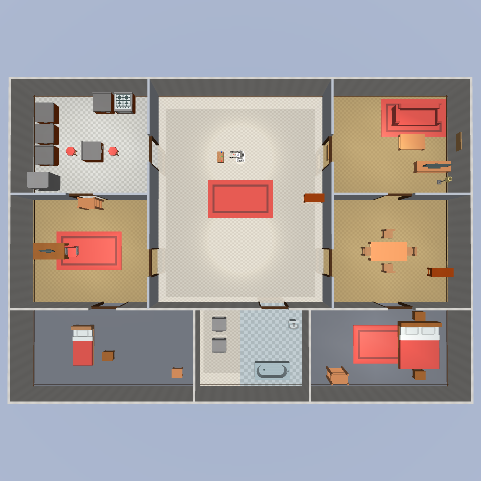

# XLeRobot 仿真部署

在本地 MuJoCo 中运行 XLeRobot 仿真，验证仿真驱动、场景文件、相机观测和系统配置。

单臂 SO101 tabletop 参考基线使用独立驱动和配置，参见
[`docs/operations/so101-tabletop-sim.md`](so101-tabletop-sim.md)。该基线不包含
LeKiwi，也不使用当前 XLeRobot 的双臂 actuator 映射。

## 配置文件

| OS | 配置 |
|---|---|
| Windows | `configs/xlerobot.sim.windows.yaml` |
| Ubuntu | `configs/xlerobot.sim.ubuntu.yaml` |
| 实验 VLA + VLN | `configs/xlerobot.sim.vla_vln.yaml` |

Windows/Ubuntu 主配置只运行 11 个 native/sim skill，不包含 ModelService。只有实验配置
声明 `vln_nav` 和 `manipulate`。

## 平台差异

| 配置项 | Windows | Ubuntu |
|---|---|---|
| 音频设备 | 设备索引号 | `null`（系统默认） |
| ASR provider | `sherpa_onnx`（本地离线） | `doubao` |
| viewer.enabled | `false` | `false` |

## 系统执行架构

```
┌─────────────────────────────────────────────────────┐
│  主进程 (.venv)  →  gateway / agent / Skill OS / robot │
│  端口 8080 (web)  →  DeepSeek / DashScope             │
│  端口 4222 (nats) →  NATS 消息总线                     │
└────────┬──────────────────────────┬─────────────────┘
         │ gRPC :9090               │ gRPC :9091
         ▼                          ▼
┌─────────────────────┐  ┌─────────────────────────┐
│ VLA 操作服务         │  │ VLN 导航服务              │
│ LeRobot Policy       │  │ InternVLA-N1-System2    │
│ (lerobot >= 0.6.0)  │  │ (transformers 4.x)      │
│ GPU 0               │  │ GPU 1                   │
└─────────────────────┘  └─────────────────────────┘
```

该图只适用于 `xlerobot.sim.vla_vln.yaml`。普通 sim 配置没有模型服务。
VLA 和 VLN 都是独立的 gRPC 模型服务，主进程通过 Skill OS 调用它们。
VLA 负责操作（manipulate），VLN 负责导航（navigate_to / approach_object）。

## 依赖分组

`pyproject.toml` 使用 `[dependency-groups]` 将不同服务的依赖分开管理，
避免 huggingface-hub、transformers 等包的版本冲突：

| 命令 | 用途 |
|------|------|
| `uv sync --group sim --group vla --group dev` | 主运行时 + VLA + MuJoCo 仿真 + 开发工具（完整环境） |
| `uv sync --group sim --group dev` | 主运行时 + MuJoCo 仿真（不含 VLA） |
| `uv sync --group vln` | VLN 模型服务 — **必须使用独立 venv** |

**版本约束（Python 3.12）：**

| 包 | 主环境 (.venv) | VLN 环境 (.vln-venv) | 冲突原因 |
|---|---|---|---|
| lerobot | >= 0.6.0 | — | 0.4.x/0.5.x dataclass bug 在 3.12 上无法 import |
| transformers | >= 5.4.0, < 5.6.0 | == 4.51.0 | lerobot 0.6.0 要求 5.x，InternNav 要求 4.x |
| huggingface-hub | >= 1.0.0 | == 0.33.4 | lerobot >= 0.5 要求 >= 1.0，transformers 4.x 要求 < 1.0 |

> **关键约束**：lerobot 0.6.0 要求 `transformers >= 5.4.0, < 5.6.0`。
> 不要使用 transformers 5.13.0+（`create_causal_mask` API 不兼容）。

VLA（LeRobot Policy）直接在主进程中加载，依赖纳入 `--group vla`。
VLN 使用独立 venv（transformers / huggingface-hub 版本冲突）。

## 环境创建

### 主环境（.venv）：运行时 + VLA + 仿真

```bash
uv sync --group sim --group vla --group dev
```

之后所有主进程命令（`hey-robot run`、`model_service`、测试脚本）都使用 `.venv/bin/python`。

如果只需要仿真 skill 调试（不需要 VLA 操作），可以省略 `--group vla`：

```bash
uv sync --group sim --group dev
```

### VLN 环境（.vln-venv）：导航模型服务

由于 VLN（InternVLA-N1）依赖 `transformers==4.51.0` + `huggingface-hub==0.33.4`，
与主环境的 `transformers>=5.4` + `huggingface-hub>=1.0` 不兼容，必须创建独立 venv：

```bash
python3.12 -m venv .vln-venv
uv sync --group vln --python .vln-venv/bin/python
```

### VLA 开发环境（.vla-venv，可选）

如需隔离测试 VLA 模型（不影响主环境），可创建独立 VLA 环境：

```bash
python3.12 -m venv .vla-venv
uv sync --group vla --python .vla-venv/bin/python
```

日常使用不需要此环境 — VLA 推理已集成在主环境中。

## 生成仿真模型

`assets/robots/xlerobot/xlerobot.xml` 是生成文件，不建议手工编辑。

```bash
python scripts/robots/xlerobot/generate_mjcf.py
```

## 场景布局俯视图

当前 XLeRobot home 仿真配置加载 `assets/scenes/home_scene.xml`，该文件组合了
`home_environment.xml` 中的 20m x 14m 家庭环境和 XLeRobot 本体。下图是从当前
MJCF 渲染得到的正俯视图，用于人工检查房间、地毯、家具和机器人出生点的相对位置。



布局维护时注意：

- 家具 mesh 的原点不一定在中心，移动物体后应以编译后的 MuJoCo 世界边界为准。
- 地毯应保持在对应房间边界内；大厅地毯中心应接近 `(10, 5)`。
- 餐厅四把椅子应朝向餐桌，椅背朝外。
- 可见资产不应低于地面；相关回归测试在 `tests/assets/test_xlerobot_home_scene.py`。

## 快速验证

运行仿真测试：

```bash
pytest tests/robot_runtime/test_simulation.py -q --no-cov
```

## 启动步骤

### 普通仿真

普通仿真不需要 ModelService：

```bash
export MUJOCO_GL=egl
uv run hey-robot run --config configs/xlerobot.sim.ubuntu.yaml
```

### 实验 VLN：1. 初始化依赖和模型

当前 checkout 必须先初始化 InternNav submodule，并准备配置所指向的模型目录：

```bash
git submodule update --init --recursive third_party/InternNav
test -d models/InternVLA-N1-System2
```

### 实验 VLN：2. 启动 VLN 服务

```bash
.vln-venv/bin/python -m hey_robot.cli.model_service \
  --config configs/xlerobot.sim.vla_vln.yaml \
  --service-id vln_nav
```

日志输出 `listening on grpc://127.0.0.1:9091` 只表示 gRPC server 已启动。还应通过
`GetHealth` 确认 `online=true`、`loaded=true`，不能依赖固定加载时间或显存数字判断。

### 实验 VLA：3. 启动 VLA 服务

VLA 操作服务是独立的 gRPC 进程，负责 LeRobot Policy 推理：

```bash
.venv/bin/python -m hey_robot.cli.model_service \
  --config configs/xlerobot.sim.vla_vln.yaml \
  --service-id manipulate
```

日志输出 `listening on grpc://127.0.0.1:9090` 表示 gRPC server 已启动。

### 实验：4. 启动主进程

headless 环境（无 X11）必须设置 EGL：

```bash
export MUJOCO_GL=egl

.venv/bin/python -m hey_robot.cli.main run \
  --config configs/xlerobot.sim.vla_vln.yaml
```

日志看到 `MuJoCo sim ready state=idle` + `Web channel started` 表示就绪。

### 5. 发送测试任务

```bash
curl -s http://localhost:8080/turn -X POST \
  -H "Content-Type: application/json" \
  -d '{"text":"走到桌子旁边","sender_id":"web-user","chat_id":"sim-dev-web"}'

# 响应: {"accepted":true,"trace_id":"tr_..."}
```

### 6. 停止

```bash
kill $(lsof -t -i:8080)   # 主进程（含 VLA 服务）
kill $(lsof -t -i:9091)   # VLN 服务
```

## VLN 配置

```yaml
model_services:
  vln_nav:
    type: vln_planner
    target: grpc://127.0.0.1:9091
    settings:
      backend: internvla_n1_system2
      mock_mode: false              # 内部测试开关；true 时跳过模型
      model_path: models/InternVLA-N1-System2
      device: cuda:1                # 使用 GPU 1，留 GPU 0 给其他任务
      attn_implementation: sdpa     # 用 PyTorch 内置 SDPA 代替 flash_attn
      internnav_repo: third_party/InternNav
      control_mode: planner_only    # 当前仅支持 planner_only
      camera: front
      image_width: 640
      image_height: 480
      resize_w: 384
      resize_h: 384
      num_history: 8
      max_new_tokens: 128
      hfov: 90
```

### 内部测试开关

| 值 | 行为 | 适用场景 |
|---|---|---|
| `true` | 返回测试替身结果（屏幕中心点/配置的 heading） | 调试 gRPC 管道、skill 调度 |
| `false` | 加载真实 InternVLA-N1 模型推理 | 实际导航验证 |

`mock_mode` 是现有配置字段名，仅用于内部测试，不表示项目对外提供独立的 Mock 机器人环境。

## 仿真配置项

| 参数 | 默认值 | 说明 |
|---|---|---|
| `mjcf_path` | `assets/scenes/home_scene.xml` | MuJoCo 场景文件 |
| `render_width` | `640` | 渲染宽度 |
| `render_height` | `480` | 渲染高度 |
| `control_hz` | `2.0` | 控制频率 |
| `linear_speed` | `0.2` | 默认线速度 (m/s) |
| `angular_speed` | `0.45` | 默认角速度 (rad/s) |
| `viewer.enabled` | `false` | 是否打开 MuJoCo 交互窗口 |

仿真摄像头（3 路，固定视角）：

| 摄像头 | 说明 |
|---|---|
| `front` | 前方视角 |
| `left_wrist` | 左腕视角 |
| `right_wrist` | 右腕视角 |

## 启用的 Skills

普通 Windows/Ubuntu 仿真配置启用 11 个非 VLA skill，和真机保持一致：

| 类别 | Skill | 说明 |
|---|---|---|
| 感知 | `inspect_scene` | 获取当前场景观察和摘要 |
| 感知 | `look_around` | 转动/扫描视野并观察 |
| 感知 | `detect_marker` | 检测可见 marker |
| 导航 | `move_base` | 底盘前进/后退 |
| 导航 | `turn_base` | 底盘左转/右转 |
| 导航 | `human_follow` | 基于视觉的人体跟随 |
| 安全 | `stop_motion` | 停止所有运动 |
| 安全 | `reset_posture` | 回到安全姿态 |
| 操作 | `set_arm_pose` | 设置机械臂命名姿态 |
| 操作 | `move_arm_joints` | 控制机械臂关节 |
| 操作 | `set_gripper` | 控制夹爪开合 |

实验 `xlerobot.sim.vla_vln.yaml` 在上述能力之外声明：

| 类别 | Skill | 当前状态 |
|---|---|---|
| 导航 | `navigate_to` | 需要 `vln_nav` gRPC 服务 |
| 导航 | `approach_object` | 需要 `vln_nav` gRPC 服务 |
| 操作 | `manipulate` | 需要 `manipulate` gRPC 服务，LeRobot Policy 直接加载 |
| 操作 | `human_follow` | 基于视觉的人体跟随（使用 YOLO 检测器） |

VLA 操作已合并为单一 `manipulate` skill，由 LeRobot Policy 直接推理，模型在进程中加载
（不再需要独立 HTTP 推理服务器或 `.vla-venv`）。已通过 MuJoCo 仿真端到端验证：
Skill OS → gRPC → LeRobot Policy 推理 → 解析原语 → 仿真执行，全部链路正常。

## VLA 模型注册

当前 VLA 环境使用 **lerobot >= 0.6.0**（Python 3.12 兼容性要求）。旧版 lerobot（0.4.x/0.5.x）与
Python 3.12 的 dataclass 严格检查不兼容。

可用模型一览，通过 `configs/xlerobot.sim.vla_vln.yaml` 中 `manipulate.settings.model_path` + `policy_type` 切换。

下载模型时建议使用 hf-mirror.com 镜像加速：

```bash
export HF_ENDPOINT=https://hf-mirror.com
huggingface-cli download <repo_id> --local-dir models/<local_name>
```

| Policy 类型 | 仓库/路径 | 说明 |
|---|---|---|
| ACT | `models/so101-act-pick-place_ACT` | 本地训练，pick-place 任务，100K 步，摄像头 front+handeye，重构前原可用模型 |
| ACT | `models/so101-act-pick-place_ACT_migrated` | 上述 ACT 的迁移版本，含 preprocessor/postprocessor safetensors |
| smolvla | `edge-inference/smolvla-so101-pick-orange` | 单任务 pick orange，500M VLM，已通过仿真端到端验证 |
| pi0.5 | `sorel/pi05-so101-record-0121` | SO101 遥操作录制数据微调，4B 参数，50K 步训练，摄像头 front+wrist |
| pi0.5 | `L7-Robotics/pi05_so101_v5.1` | SO101 多任务微调（红积木/黑笔对比），4K 步，3 摄像头 |
| pi0.5 | `lerobot/pi05_base` | Physical Intelligence 预训练基座，需在 SO101 数据上微调后使用 |
| pi0.5 | `lerobot/pi05_libero_finetuned` | LIBERO benchmark 微调（Franka 手臂），**不适配 SO101** |

### 切换到 sorel/pi05

```bash
export HF_ENDPOINT=https://hf-mirror.com
huggingface-cli download sorel/pi05-so101-record-0121 --local-dir models/pi05-so101-record-0121
```

然后在 `configs/xlerobot.sim.vla_vln.yaml` 中修改：

```yaml
manipulate:
  settings:
    model_path: "models/pi05-so101-record-0121"
    policy_type: "pi05"
```

`sorel/pi05-so101-record-0121` 摄像头 key 为 `observation.images.front` + `observation.images.wrist`，
与当前仿真摄像头名称兼容，无需额外映射。

## Docker 部署

项目提供 `docker-compose.yml` + 两个 Dockerfile，支持容器化部署。

### 服务架构（Docker）

```
┌───────────────────────────────────────┐
│  nats:2.10-alpine                     │  消息总线
│  端口 4222 (client) 8222 (monitor)     │
└──────────────┬────────────────────────┘
               │
     ┌─────────┼─────────┐
     ▼         ▼         ▼
┌─────────┐ ┌─────────┐ ┌──────────────────────────┐
│ vla     │ │ vln     │ │ runtime                  │
│ GPU 0   │ │ GPU 1   │ │ Agent / Skill OS / Robot │
│ :9090   │ │ :9091   │ │ :8080 (web)              │
└─────────┘ └─────────┘ └──────────────────────────┘
```

三个应用容器，VLA 和 VLN 各自独立 gRPC 模型服务。VLN 独立部署以隔离依赖冲突。

### 构建镜像

```bash
# 主运行时镜像
docker build -f docker/Dockerfile -t hey-robot:latest .

# VLA 操作服务镜像（LeRobot Policy，GPU 0）
docker build -f docker/Dockerfile.vla -t hey-robot-vla:latest .

# VLN 导航服务镜像（InternVLA-N1，GPU 1）
docker build -f docker/Dockerfile.vln -t hey-robot-vln:latest .
```

### 启动

```bash
# 仅消息总线 + 运行时（无 GPU，无模型服务）
docker compose up -d nats runtime

# 完整服务（含 VLA + VLN，需要 2 GPU）
docker compose --profile gpu up -d
```

### 环境变量

| 变量 | 默认值 | 说明 |
|------|--------|------|
| `HEY_ROBOT_NATS_PORT` | 4222 | NATS 客户端端口 |
| `HEY_ROBOT_VLA_PORT` | 9090 | VLA gRPC 端口 |
| `HEY_ROBOT_VLA_GPU` | 0 | VLA 使用的 GPU 编号 |
| `HEY_ROBOT_VLA_CONFIG` | `configs/xlerobot.sim.vla_vln.yaml` | VLA 配置文件 |
| `HEY_ROBOT_VLA_SERVICE_ID` | `manipulate` | VLA 服务 ID |
| `HEY_ROBOT_VLN_PORT` | 9091 | VLN gRPC 端口 |
| `HEY_ROBOT_VLN_GPU` | 1 | VLN 使用的 GPU 编号 |
| `HEY_ROBOT_VLN_CONFIG` | `configs/xlerobot.sim.ubuntu.yaml` | VLN 配置文件 |
| `HEY_ROBOT_VLN_SERVICE_ID` | `vln_nav` | VLN 服务 ID |
| `HEY_ROBOT_GATEWAY_PORT` | 8080 | Web gateway 端口 |
| `HEY_ROBOT_MONITOR_PORT` | 8081 | 监控端口 |

### Dockerfile 说明

**`docker/Dockerfile`** — 主运行时镜像：
- 基础镜像：`python:3.12-slim`
- 依赖：`uv sync --group sim --group vla --group dev`
- 入口：`hey-robot run --config <config>`

**`docker/Dockerfile.vla`** — VLA 操作服务：
- 基础镜像：`nvidia/cuda:12.6.2-cudnn-runtime-ubuntu24.04`
- 依赖：`uv sync --group vla`（仅 lerobot + torch，不需要 MuJoCo）
- 入口：`python -m hey_robot.cli.model_service --service-id manipulate`
- GPU 0，gRPC :9090

**`docker/Dockerfile.vln`** — VLN 导航服务：
- 基础镜像：`nvidia/cuda:12.6.2-cudnn-runtime-ubuntu24.04`
- 分步安装保证版本链：先装 `huggingface-hub<1.0`，再装 `transformers==4.51.0`，最后 `--no-deps` 装项目
- 入口：`python -m hey_robot.cli.model_service --service-id vln_nav`
- GPU 1，gRPC :9091

## 常见问题

### MuJoCo 启动报 OpenGL/GLFW 错误

headless 环境没有 X11 显示，需要改用 EGL 渲染：

```bash
export MUJOCO_GL=egl
```

确认 `libEGL.so` 已安装：`ldconfig -p | grep libEGL`

### VLN 报 huggingface-hub 版本冲突

说明 VLN 服务用了主环境。VLN 需要 `huggingface-hub==0.33.4`，主运行时不依赖
huggingface-hub。必须用 `.vln-venv` 启动 VLN 服务。详见上方「依赖分组」。

### flash_attn 编译/加载失败

配置已设 `attn_implementation: sdpa`，InternNav executor 会自动将 `flash_attention_2` patch 为 PyTorch 内置 SDPA（要求 torch >= 2.0）。不需要 `pip install flash-attn`。

### 看不到 LeKiwi 底盘

重新生成模型：

```bash
python scripts/robots/xlerobot/generate_mjcf.py
```

生成后的 MJCF 应包含 `lekiwi_chassis_visual`、`base_plate`、`Omni-Directional-Wheel` 等几何体。

### 中间出现黑色实体块

通常是 collision box 被渲染出来。不要手工修改 `xlerobot.xml`，应修改 `scripts/robots/xlerobot/generate_mjcf.py` 后重新生成。

### 修改 `xlerobot.xml` 后被覆盖

这是预期行为。请修改生成器脚本后重新运行。

### MuJoCo viewer 窗口不显示

Windows 和 Ubuntu 当前配置都设置 `viewer.enabled: false`。需要交互窗口时显式改为
`true`，并确保存在图形环境（X11/Wayland/Windows desktop）；headless 环境保持关闭并
使用 EGL。

### 麦克风/语音不工作

Ubuntu 使用系统默认音频设备（`input_device: null`），Windows 根据
`scripts/audio/list_devices.py` 的输出调整设备索引。注意当前 Ubuntu 仿真配置使用云端
Doubao ASR，需要有效的 `ARK_API_KEY`；Windows 仿真配置使用本地 sherpa-onnx。
### gRPC 请求超时 (DEADLINE_EXCEEDED)

配置中 `target: grpc://127.0.0.1:9091` 的 `grpc://` 前缀是项目内部格式，`GrpcModelServiceClient` 会自动去掉。如果直接使用 gRPC 客户端工具测试，目标地址应为 `127.0.0.1:9091`（不带 scheme）。
